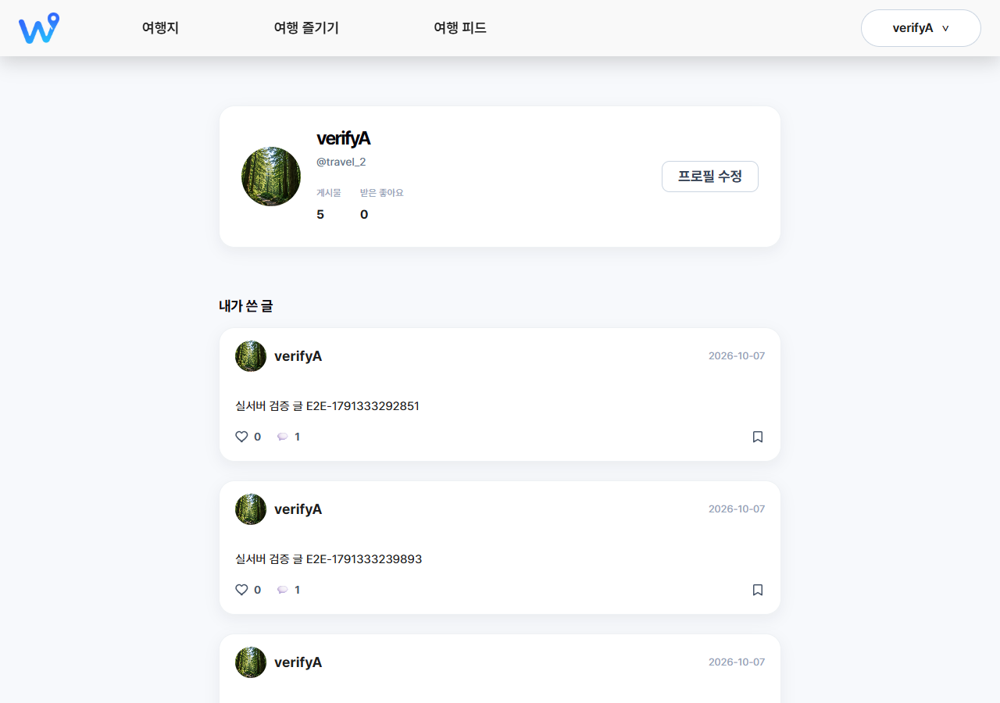
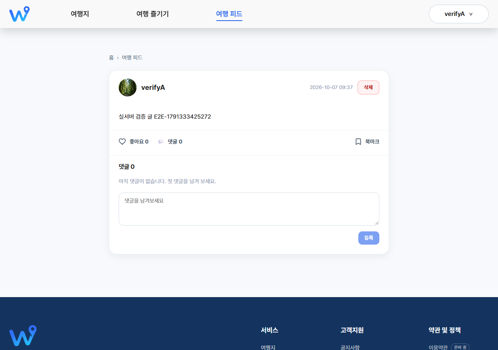
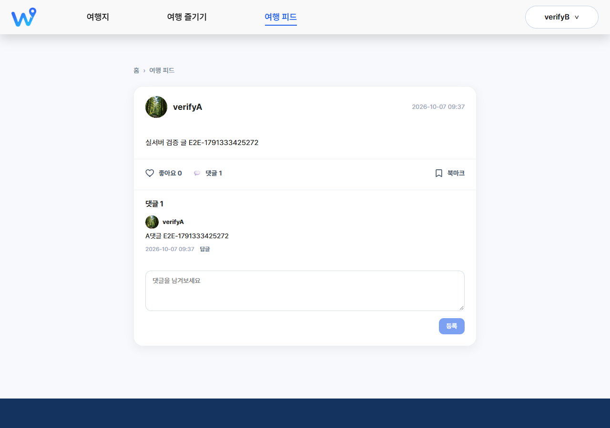

# WayLog

WayLog는 국내 여행지를 탐색하고 기록하는 서비스입니다. 이 저장소는 백엔드(Spring Boot)와 프론트엔드(React)를 하나의 모노레포로 관리합니다.

```
waylog/
├── backend/    Spring Boot 4 (Java 25) REST API, DB 마이그레이션(db/)
├── frontend/   React 19 + Vite 웹 클라이언트
├── docs/       기능별 계획·설계·분석·보고서, 검증 기록, 포트폴리오 자료
└── .claude/    프로젝트 공용 Claude Code 에이전트·스킬 정의
```

## 서비스 소개

WayLog는 국내 여행지를 찾아보고, 여행 코스를 살펴보고, 여행 기록을 피드로 나누는 웹 서비스입니다. 관광 데이터는 한국관광공사 TourAPI를 백엔드가 중개해 제공합니다.

- 여행지·즐길거리 검색, 필터·정렬·페이지 이동이 URL과 동기화됩니다.
- 관광지·축제·음식점 상세에서 북마크를 저장하고, 마이페이지와 북마크 목록에서 다시 확인합니다.
- 여행 피드에 글과 사진을 올리고, 댓글을 달고 삭제할 수 있습니다. 작성자가 아니면 글과 댓글을 삭제할 수 없습니다(서버가 403으로 거부합니다). 글·댓글 수정 기능은 아직 없습니다.
- 관리자 콘솔에서 공지, 회원, 피드, 여행 코스를 관리합니다.

## 주요 화면 (실서버 검증 캡처)

| 세션 복원 후 마이페이지 | 댓글 삭제 후 피드 글 | 타인 계정이 본 피드 글 |
|---|---|---|
|  |  |  |

위 3장은 검증 기록 중 공개 가능한 것만 골랐습니다. 여행지 검색, 상세, 북마크 목록 화면은 검증 기록에 캡처가 없어서 여기에 넣지 않았습니다.

## 기술 사례

- [인증 토큰 보관·세션 복원·재발급 경쟁 조건](docs/portfolio/technical-cases.md#사례-1-인증-토큰-보관세션-복원과-재발급-경쟁-조건)
- [관광 검색·상세의 실제 API 연동과 비동기 UI](docs/portfolio/technical-cases.md#사례-2-관광-검색상세의-실제-api-연동과-비동기-ui)
- [북마크·댓글 상태 정합성과 회귀 테스트](docs/portfolio/technical-cases.md#사례-3-북마크댓글-상태-정합성과-회귀-테스트)
- 각 사례의 대안·선택 이유·한계는 위 문서에 있습니다.

## 검증 결과

검증 기준은 "실행한 항목만 통과로 기록"입니다. 상세 결과와 미검증 항목은 다음 기록에 있습니다. 이전 기준 [`1dcfa40` 검증](docs/validation/2026-10-07-live-validation.md), [`4f91276` 검증](docs/validation/2026-10-07-live-validation-4f91276.md), [인증·DB 독립 리뷰와 최종 재실행](docs/validation/2026-10-07-independent-review-auth-db.md).

| 구분 | 결과 | 기준 커밋 |
|---|---|---|
| 백엔드 테스트 | 194개 통과, 실패 0 | `caa8302` |
| 프론트 테스트 (Vitest) | 182개 통과 | `caa8302` |
| 프론트 lint, build | 오류 0, build 성공 (500kB 청크 경고는 기존 이슈) | `caa8302` |
| 실서버 시나리오 | 12개 실행, 12개 통과 (브라우저 10, API 2). 로컬 H2 프로필 | `caa8302` |

인증·DB 최종 변경분은 독립 리뷰를 완료했고, Must 1건(마이페이지 비밀번호 변경)을 수정했습니다.

**아직 확인하지 못한 것 (운영 환경)**: 운영 DB 스키마와 마이그레이션 적용 여부, MySQL 콜레이션에 따른 대소문자·끝 공백 판정, 운영 SMTP 메일 발송, 다중 인스턴스에서의 제한 공유. 약관 이력 저장(마케팅 동의 보존)은 아직 구현하지 않았습니다.

## 본인 기여와 Claude Code 보조

WayLog는 Claude Code와 함께 만들었습니다. 구현과 테스트 작성은 Claude Code가 보조했고, 방향과 승인은 제가 정했습니다.

- 목업 페이지를 실제 API에 연결할지, 미구현 기능을 숨길지 결정했습니다.
- 검증 기준을 정했습니다. 실행하지 않은 항목은 통과로 기록하지 않습니다.
- 관리자 대시보드의 리소스 범위와 정지 정책(기간제 로그인 차단)을 정했습니다.
- 커밋 방식을 정하고 push 시점을 직접 승인했습니다.

Claude Code가 보조한 범위와 제가 직접 확인해야 할 항목은 [보조 범위 문서](docs/portfolio/ai-assistance-scope.md)에 구분해 두었습니다.

## Backend (`backend/`)

Spring Boot 4 / Java 25 / Spring Data JPA / Spring Security 기반 REST API입니다.

> **JDK 25가 필요합니다.** `pom.xml`의 `java.version`은 25이며, `JAVA_HOME`이 JDK 17을 가리키면 빌드가 실패합니다. 빌드 전에 `java -version`이 25인지 확인하세요. Windows에서 JDK 25 경로를 직접 지정하려면 `$env:JAVA_HOME = "C:\path\to\jdk-25"`처럼 현재 셸에만 설정할 수 있습니다.

```bash
cd backend
./mvnw clean test   # 테스트 실행
./mvnw spring-boot:run   # 로컬 실행
```

실행 시 아래 환경변수가 필요합니다 (`src/main/resources/application.yaml` 참고):

- `JWT_SECRET` — JWT(HS256) 서명에 사용할 비밀키. 운영에서는 새로 발급한 무작위 값을 사용하세요.
  - 코드(`JwtConfig`)는 이 문자열을 Base64로 디코딩하지 않고, 문자열의 바이트를 그대로 서명 키로 씁니다. Base64 형식의 문자열을 넣어도 동작하지만 디코딩되지는 않습니다.
  - 32바이트(영문·숫자 기준 32자) 이상이어야 합니다. 더 짧으면 서버가 기동 중 키 길이 오류로 실패합니다.
  - 키를 바꾸면 이전 키로 서명된 액세스·리프레시 토큰이 모두 무효가 되어, 로그인 중인 사용자는 다시 로그인해야 합니다. 리프레시 토큰은 서버에 저장하지 않으므로 이전 토큰을 이어서 쓸 방법이 없습니다.
- `DB_URL`, `DB_USER`, `DB_PW` — MySQL 접속 정보
- `MAIL_USERNAME`, `MAIL_PW` — 이메일 인증 발송용 SMTP 계정
- `TOUR_API` — 한국관광공사 TourAPI 서비스키
- `FRONTEND_ORIGEN` — CORS 허용 오리진 (프론트엔드 주소)
- `STORAGE_TYPE`, `S3_BUCKET`, `AWS_REGION` — 게시글 이미지 저장에 사용하는 S3 설정
- `SERVER_PORT` — 서버 포트

테스트는 `application-test.yaml`의 H2 인메모리 DB와 더미 값을 사용하므로 별도 환경변수 없이 `./mvnw clean test`로 바로 실행할 수 있습니다.

### 로컬 실행 (MySQL 없이, TourAPI 키 하나만)

`local` 프로필(`application-local.yaml`)은 H2 인메모리 DB와 더미 JWT·메일·S3 값, 포트 8080, CORS `http://localhost:5173`을 사용합니다. `backend/.env`는 `application.yaml`의 `spring.config.import`로 자동으로 읽힙니다(없어도 기동됨, git 무시 대상).

```powershell
cd backend
Copy-Item .env.example .env        # .env 의 TOUR_API= 뒤에 공공데이터포털 "Decoding" 키 입력
.\mvnw.cmd spring-boot:run "-Dspring-boot.run.profiles=local"
```

- TourAPI 키 없이 개발할 때: `"-Dspring-boot.run.profiles=local,local-mock"` (Mock 데이터 사용)
- 프로필은 `.env`가 아니라 실행 인자로 지정합니다.
- 로컬 프로필에서는 메일 발송·S3 이미지 업로드가 동작하지 않으며, DB는 종료 시 초기화됩니다.

## Frontend (`frontend/`)

React 19 + Vite + react-router-dom 기반 SPA입니다.

```bash
cd frontend
npm install
npm run dev     # 개발 서버
npm run build   # 프로덕션 빌드
npm run lint    # ESLint 검사
npm test        # Vitest 회귀 테스트(순수 로직, 182개)
```

## 이번 재구축 범위

기존 기능·화면·디자인은 그대로 유지하면서 구조·보안·코드 품질을 개선했습니다. 새로운 기능 추가나 mock 데이터의 실제 API 연동은 이번 작업 범위에 포함되지 않습니다.

### Backend
- 아무 데서도 참조되지 않던 빈 엔티티/레포지토리/컨트롤러 스텁을 삭제했습니다.
- `user` 관련 클래스(엔티티, 레포지토리, 컨트롤러, 서비스, DTO)를 `user/` 기능 패키지로 재구성했습니다.
- `UserEntity`를 `@Data` + snake_case 필드에서 `@Getter` + camelCase 필드로 통일하고, board 패키지의 `Post`/`PostImage`/`Comment` 엔티티도 동일한 스타일(`@Getter` + 명시적 생성자/메서드)로 정리했습니다.
- **보안**: JWT 시크릿을 소스에 하드코딩하지 않고 `JWT_SECRET` 환경변수로 분리했습니다. **저장소에 노출되었던 기존 시크릿 값은 폐기되었으므로 운영 환경에서는 새 값을 발급해 사용해야 합니다.**
- **보안**: 이메일 인증코드를 `HttpSession`에 저장하던 방식을 Caffeine 캐시(만료시간 기반)로 교체했습니다.
- **보안**: 프론트엔드 주소를 하드코딩한 컨트롤러별 `@CrossOrigin`을 제거하고, 전역 `WebConfig`의 CORS 설정만 사용하도록 정리했습니다.
- 미사용 `spring-security-jwt`(레거시), `spring-security-oauth2-client`(미완성 카카오 로그인 스캐폴딩) 의존성과 관련 설정을 제거했습니다.
- 빌드 산출물(`target/`)을 `.gitignore`에 추가하고 git 추적에서 제외했습니다.

### Frontend
- `node_modules/`, `dist/` 등 빌드 산출물을 `.gitignore`에 추가하고 git 추적에서 제외했습니다.
- `window.location.pathname` 기반 분기 처리를 `react-router-dom`의 `Routes`/`Route` 구조로 전환했습니다.
- 로그인 상태를 `AuthContext`로 통일했습니다. (기존에는 로그인 시 `sessionStorage`에 `member` 키로 저장하고 헤더는 `waylogMember` 키를 읽어, 로그인해도 헤더가 갱신되지 않는 버그가 있었습니다.)
- 페이지마다 중복 렌더링되던 `Header`/`Footer`를 공용 `Layout` 컴포넌트로 통합했습니다.
- 완전히 동일한 로직의 `TravelSearchModal`/`EnjoySearchModal`을 공용 `SearchModal` 컴포넌트 기반으로 통합했습니다.
- 공용 `apiClient`(`src/api/client.js`)를 도입해 페이지마다 중복되던 raw `fetch` 호출을 정리했습니다.
- 어디서도 사용되지 않던 `EditorPickSection` 컴포넌트를 삭제했습니다.
